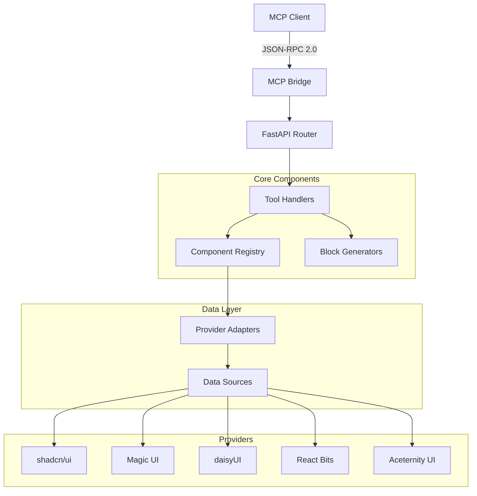

# Lea MCP Server - Technical Architecture

## 🏗️ System Architecture



## 📁 Project Structure

```
lea/
├── mcp_ui_aggregator/
│   ├── __init__.py
│   ├── api/
│   │   ├── __init__.py
│   │   ├── app.py                 # Main FastAPI application
│   │   ├── lea_mcp_server.py      # MCP server implementation
│   │   ├── mcp_bridge.py          # JSON-RPC to REST bridge
│   │   └── blocks_api.py          # UI block generators
│   ├── core/
│   │   ├── __init__.py
│   │   ├── config.py              # Configuration management
│   │   └── database.py            # Database connections
│   ├── models/
│   │   ├── __init__.py
│   │   └── database.py            # Data models
│   ├── ingestion/
│   │   ├── __init__.py
│   │   ├── base.py                # Base provider interface
│   │   ├── shadcn_ui.py          # shadcn/ui provider
│   │   ├── magic_ui.py           # Magic UI provider
│   │   └── ...                   # Other providers
│   ├── search/
│   │   ├── __init__.py
│   │   └── engine.py             # Search implementation
│   └── tools/
│       ├── __init__.py
│       └── component_tools.py     # MCP tool implementations
├── examples/
│   └── nextjs-demo/              # Next.js integration example
├── tests/
│   ├── unit/
│   └── integration/
├── docs/
├── requirements.txt
├── pyproject.toml
└── README.md
```

## 🔧 Core Components

### 1. MCP Server (`lea_mcp_server.py`)

The main MCP server implementation using the `mcp` Python SDK.

```python
from mcp.server import Server
from mcp.types import Tool, TextContent

class LeaMCPServer:
    def __init__(self):
        self.server = Server("lea-ui-components")
        self.setup_tools()
    
    def setup_tools(self):
        """Register all MCP tools"""
        
        @self.server.list_tools()
        async def list_tools() -> list[Tool]:
            return [
                Tool(
                    name="list_components",
                    description="List all available UI components",
                    inputSchema={
                        "type": "object",
                        "properties": {
                            "provider": {"type": "string"},
                            "category": {"type": "string"},
                            "limit": {"type": "integer", "default": 50}
                        }
                    }
                ),
                # ... other tools
            ]
        
        @self.server.call_tool()
        async def call_tool(name: str, arguments: dict) -> list[TextContent]:
            if name == "list_components":
                return await self.handle_list_components(arguments)
            elif name == "get_block":
                return await self.handle_get_block(arguments)
            # ... other tool handlers
```

### 2. JSON-RPC Bridge (`mcp_bridge.py`)

Bridges MCP JSON-RPC protocol to internal REST APIs.

```python
from fastapi import APIRouter, HTTPException
from pydantic import BaseModel
import httpx

class MCPRequest(BaseModel):
    jsonrpc: str = "2.0"
    id: int
    method: str
    params: dict = {}

class MCPResponse(BaseModel):
    jsonrpc: str = "2.0"
    id: int
    result: dict = None
    error: dict = None

router = APIRouter()

@router.post("/mcp")
async def mcp_endpoint(request: MCPRequest) -> MCPResponse:
    """Main MCP JSON-RPC endpoint"""
    
    if request.method == "initialize":
        return MCPResponse(
            id=request.id,
            result={
                "protocolVersion": "2024-11-05",
                "capabilities": {"tools": {}},
                "serverInfo": {
                    "name": "Lea UI Components",
                    "version": "1.0.0"
                }
            }
        )
    
    elif request.method == "tools/list":
        # Return available tools
        tools = await get_available_tools()
        return MCPResponse(id=request.id, result={"tools": tools})
    
    elif request.method == "tools/call":
        # Execute tool and return result
        tool_name = request.params.get("name")
        arguments = request.params.get("arguments", {})
        
        result = await execute_tool(tool_name, arguments)
        return MCPResponse(id=request.id, result=result)
    
    else:
        return MCPResponse(
            id=request.id,
            error={"code": -32601, "message": "Method not found"}
        )
```

### 3. Tool Handlers (`component_tools.py`)

Implementation of individual MCP tools.

```python
from typing import Dict, List, Any
import json

class ComponentTools:
    def __init__(self, registry, search_engine):
        self.registry = registry
        self.search_engine = search_engine
    
    async def list_components(self, params: Dict[str, Any]) -> Dict[str, Any]:
        """List components with optional filtering"""
        provider = params.get("provider")
        category = params.get("category") 
        limit = params.get("limit", 50)
        
        components = await self.registry.get_components(
            provider=provider,
            category=category,
            limit=limit
        )
        
        return {
            "content": [{
                "type": "text",
                "text": json.dumps({
                    "components": [c.to_dict() for c in components],
                    "total": len(components)
                })
            }]
        }
    
    async def search_components(self, params: Dict[str, Any]) -> Dict[str, Any]:
        """Search components by query"""
        query = params.get("query", "")
        provider = params.get("provider")
        limit = params.get("limit", 20)
        
        results = await self.search_engine.search(
            query=query,
            provider=provider,
            limit=limit
        )
        
        return {
            "content": [{
                "type": "text", 
                "text": json.dumps({
                    "results": [r.to_dict() for r in results],
                    "query": query,
                    "total": len(results)
                })
            }]
        }
    
    async def get_component_code(self, params: Dict[str, Any]) -> Dict[str, Any]:
        """Get component source code"""
        component_id = params.get("component_id")
        framework = params.get("framework", "react")
        typescript = params.get("typescript", True)
        
        component = await self.registry.get_component(component_id)
        if not component:
            raise ValueError(f"Component {component_id} not found")
        
        code = await component.get_code(
            framework=framework,
            typescript=typescript
        )
        
        return {
            "content": [{
                "type": "text",
                "text": json.dumps({
                    "code": code.content,
                    "dependencies": code.dependencies,
                    "file_name": code.file_name,
                    "framework": framework
                })
            }]
        }
```

### 4. Component Registry (`registry.py`)

Central registry for managing components from all providers.

```python
from typing import List, Optional, Dict
from .models import Component, Provider

class ComponentRegistry:
    def __init__(self):
        self.providers: Dict[str, Provider] = {}
        self.components: Dict[str, Component] = {}
        self._load_providers()
    
    def _load_providers(self):
        """Load all provider adapters"""
        from .ingestion import (
            ShadcnProvider, MagicUIProvider, 
            DaisyUIProvider, ReactBitsProvider
        )
        
        providers = [
            ShadcnProvider(),
            MagicUIProvider(),
            DaisyUIProvider(),
            ReactBitsProvider(),
        ]
        
        for provider in providers:
            self.providers[provider.name] = provider
            # Load components from provider
            components = provider.get_components()
            for component in components:
                self.components[component.id] = component
    
    async def get_components(
        self, 
        provider: Optional[str] = None,
        category: Optional[str] = None,
        limit: int = 50
    ) -> List[Component]:
        """Get components with filtering"""
        
        components = list(self.components.values())
        
        if provider:
            components = [c for c in components if c.provider == provider]
        
        if category:
            components = [c for c in components if c.category == category]
        
        return components[:limit]
    
    async def get_component(self, component_id: str) -> Optional[Component]:
        """Get specific component by ID"""
        return self.components.get(component_id)
    
    async def search_components(self, query: str) -> List[Component]:
        """Search components by query"""
        results = []
        query_lower = query.lower()
        
        for component in self.components.values():
            if (query_lower in component.name.lower() or
                query_lower in component.description.lower() or
                any(query_lower in tag.lower() for tag in component.tags)):
                results.append(component)
        
        return results
```

### 5. Provider Adapters

Base interface for component providers.

```python
from abc import ABC, abstractmethod
from typing import List
from ..models import Component

class BaseProvider(ABC):
    def __init__(self, name: str, base_url: str):
        self.name = name
        self.base_url = base_url
    
    @abstractmethod
    async def get_components(self) -> List[Component]:
        """Fetch all components from provider"""
        pass
    
    @abstractmethod
    async def get_component_code(self, component_id: str) -> str:
        """Get source code for specific component"""
        pass
    
    @abstractmethod
    async def get_component_docs(self, component_id: str) -> str:
        """Get documentation for specific component"""
        pass

class ShadcnProvider(BaseProvider):
    def __init__(self):
        super().__init__("shadcn", "https://ui.shadcn.com")
    
    async def get_components(self) -> List[Component]:
        """Implementation for shadcn/ui components"""
        components = []
        
        # Fetch from shadcn registry
        registry_data = await self._fetch_registry()
        
        for item in registry_data:
            component = Component(
                id=f"shadcn-{item['name']}",
                name=item['name'],
                provider="shadcn",
                category=self._map_category(item['type']),
                description=item.get('description', ''),
                tags=item.get('tags', []),
                source_url=f"{self.base_url}/docs/components/{item['name']}"
            )
            components.append(component)
        
        return components
    
    async def _fetch_registry(self):
        """Fetch component registry from shadcn"""
        # Implementation to fetch from shadcn API/registry
        pass
```

## 🔍 Search Engine

Implements semantic search across components.

```python
from typing import List, Dict, Any
import re
from fuzzywuzzy import fuzz

class SearchEngine:
    def __init__(self, registry):
        self.registry = registry
        self._build_search_index()
    
    def _build_search_index(self):
        """Build search index for fast lookups"""
        self.index = {}
        
        for component in self.registry.components.values():
            # Index by name, description, tags
            terms = [
                component.name.lower(),
                component.description.lower(),
                *[tag.lower() for tag in component.tags]
            ]
            
            for term in terms:
                words = re.findall(r'\w+', term)
                for word in words:
                    if word not in self.index:
                        self.index[word] = []
                    self.index[word].append(component.id)
    
    async def search(
        self, 
        query: str, 
        provider: str = None,
        limit: int = 20
    ) -> List[Dict[str, Any]]:
        """Perform search with ranking"""
        
        query_words = re.findall(r'\w+', query.lower())
        candidates = set()
        
        # Find candidates from index
        for word in query_words:
            if word in self.index:
                candidates.update(self.index[word])
        
        # Score and rank results
        results = []
        for component_id in candidates:
            component = self.registry.components.get(component_id)
            if not component:
                continue
            
            if provider and component.provider != provider:
                continue
            
            score = self._calculate_relevance_score(component, query)
            results.append({
                "component": component,
                "score": score
            })
        
        # Sort by relevance score
        results.sort(key=lambda x: x["score"], reverse=True)
        
        return [r["component"] for r in results[:limit]]
    
    def _calculate_relevance_score(self, component, query: str) -> float:
        """Calculate relevance score for ranking"""
        score = 0.0
        
        # Exact name match
        if query.lower() == component.name.lower():
            score += 100
        
        # Name similarity
        name_similarity = fuzz.ratio(query.lower(), component.name.lower())
        score += name_similarity * 0.8
        
        # Description similarity  
        desc_similarity = fuzz.partial_ratio(query.lower(), component.description.lower())
        score += desc_similarity * 0.4
        
        # Tag matches
        for tag in component.tags:
            if query.lower() in tag.lower():
                score += 20
        
        return score
```

## 🎨 Block Generators

Generate complete UI blocks combining multiple components.

```python
from typing import Dict, List, Any
from .models import UIBlock, ComponentFile

class BlockGenerator:
    def __init__(self, registry):
        self.registry = registry
    
    async def generate_block(
        self, 
        block_type: str,
        target: str = "react",
        style: str = "tailwind",
        theme: str = "light"
    ) -> UIBlock:
        """Generate complete UI block"""
        
        if block_type == "auth":
            return await self._generate_auth_block(target, style, theme)
        elif block_type == "navbar":
            return await self._generate_navbar_block(target, style, theme)
        elif block_type == "hero":
            return await self._generate_hero_block(target, style, theme)
        elif block_type == "pricing":
            return await self._generate_pricing_block(target, style, theme)
        else:
            raise ValueError(f"Unsupported block type: {block_type}")
    
    async def _generate_auth_block(self, target: str, style: str, theme: str) -> UIBlock:
        """Generate authentication form block"""
        
        if target == "nextjs" and style == "tailwind":
            code = self._get_nextjs_tailwind_auth_form(theme)
            
            return UIBlock(
                name="Authentication Form",
                description="Complete login/signup form with validation",
                block_type="auth",
                files=[
                    ComponentFile(
                        path="components/AuthenticationForm.tsx",
                        content=code,
                        language="typescript"
                    )
                ],
                dependencies=[
                    "react-hook-form",
                    "@hookform/resolvers", 
                    "zod"
                ],
                instructions=[
                    "1. Install dependencies: npm install react-hook-form @hookform/resolvers zod",
                    "2. Copy the component to your components directory",
                    "3. Import and use: <AuthenticationForm />"
                ]
            )
    
    def _get_nextjs_tailwind_auth_form(self, theme: str) -> str:
        """Generate Next.js + Tailwind auth form code"""
        
        theme_classes = {
            "light": "bg-white text-gray-900",
            "dark": "bg-gray-900 text-white"
        }
        
        bg_class = theme_classes.get(theme, theme_classes["light"])
        
        return f'''
'use client';
import React from 'react';
import {{ useForm }} from 'react-hook-form';
import {{ zodResolver }} from '@hookform/resolvers/zod';
import {{ z }} from 'zod';

const loginSchema = z.object({{
  email: z.string().email('Invalid email address'),
  password: z.string().min(6, 'Password must be at least 6 characters'),
}});

type LoginFormData = z.infer<typeof loginSchema>;

export default function AuthenticationForm() {{
  const {{ register, handleSubmit, formState: {{ errors }} }} = useForm<LoginFormData>({{
    resolver: zodResolver(loginSchema),
  }});

  const onSubmit = (data: LoginFormData) => {{
    console.log('Login data:', data);
  }};

  return (
    <div className="min-h-screen flex items-center justify-center {bg_class} py-12 px-4 sm:px-6 lg:px-8">
      <div className="max-w-md w-full space-y-8">
        <div>
          <h2 className="mt-6 text-center text-3xl font-extrabold">
            Sign in to your account
          </h2>
        </div>
        <form className="mt-8 space-y-6" onSubmit={{handleSubmit(onSubmit)}}>
          <div className="space-y-4">
            <div>
              <label htmlFor="email" className="block text-sm font-medium">
                Email address
              </label>
              <input
                {{...register('email')}}
                type="email"
                className="mt-1 block w-full px-3 py-2 border border-gray-300 rounded-md shadow-sm focus:outline-none focus:ring-indigo-500 focus:border-indigo-500"
              />
              {{errors.email && (
                <p className="mt-1 text-sm text-red-600">{{errors.email.message}}</p>
              )}}
            </div>
            
            <div>
              <label htmlFor="password" className="block text-sm font-medium">
                Password
              </label>
              <input
                {{...register('password')}}
                type="password"
                className="mt-1 block w-full px-3 py-2 border border-gray-300 rounded-md shadow-sm focus:outline-none focus:ring-indigo-500 focus:border-indigo-500"
              />
              {{errors.password && (
                <p className="mt-1 text-sm text-red-600">{{errors.password.message}}</p>
              )}}
            </div>
          </div>

          <div>
            <button
              type="submit"
              className="group relative w-full flex justify-center py-2 px-4 border border-transparent text-sm font-medium rounded-md text-white bg-indigo-600 hover:bg-indigo-700 focus:outline-none focus:ring-2 focus:ring-offset-2 focus:ring-indigo-500"
            >
              Sign in
            </button>
          </div>
        </form>
      </div>
    </div>
  );
}}'''
```

## 🧪 Testing

### Unit Tests

```python
import pytest
from unittest.mock import Mock, AsyncMock
from mcp_ui_aggregator.tools.component_tools import ComponentTools

@pytest.fixture
def mock_registry():
    registry = Mock()
    registry.get_components = AsyncMock(return_value=[])
    return registry

@pytest.fixture  
def mock_search_engine():
    engine = Mock()
    engine.search = AsyncMock(return_value=[])
    return engine

@pytest.fixture
def component_tools(mock_registry, mock_search_engine):
    return ComponentTools(mock_registry, mock_search_engine)

@pytest.mark.asyncio
async def test_list_components(component_tools, mock_registry):
    # Arrange
    mock_components = [Mock(to_dict=lambda: {"id": "test", "name": "Test"})]
    mock_registry.get_components.return_value = mock_components
    
    # Act
    result = await component_tools.list_components({"limit": 10})
    
    # Assert
    assert "content" in result
    assert len(result["content"]) == 1
    mock_registry.get_components.assert_called_once_with(
        provider=None, category=None, limit=10
    )

@pytest.mark.asyncio
async def test_search_components(component_tools, mock_search_engine):
    # Arrange
    mock_results = [Mock(to_dict=lambda: {"id": "button", "name": "Button"})]
    mock_search_engine.search.return_value = mock_results
    
    # Act  
    result = await component_tools.search_components({"query": "button"})
    
    # Assert
    assert "content" in result
    mock_search_engine.search.assert_called_once_with(
        query="button", provider=None, limit=20
    )
```

### Integration Tests

```python
import pytest
import httpx
from fastapi.testclient import TestClient
from mcp_ui_aggregator.api.app import app

@pytest.fixture
def client():
    return TestClient(app)

def test_mcp_initialize(client):
    response = client.post("/mcp", json={
        "jsonrpc": "2.0",
        "id": 1,
        "method": "initialize", 
        "params": {
            "protocolVersion": "2024-11-05",
            "capabilities": {},
            "clientInfo": {"name": "test", "version": "1.0"}
        }
    })
    
    assert response.status_code == 200
    data = response.json()
    assert data["jsonrpc"] == "2.0"
    assert data["id"] == 1
    assert "result" in data
    assert data["result"]["serverInfo"]["name"] == "Lea UI Components"

def test_mcp_tools_list(client):
    response = client.post("/mcp", json={
        "jsonrpc": "2.0",
        "id": 2,
        "method": "tools/list",
        "params": {}
    })
    
    assert response.status_code == 200
    data = response.json()
    assert "result" in data
    assert "tools" in data["result"]
    assert len(data["result"]["tools"]) == 7

def test_mcp_get_block(client):
    response = client.post("/mcp", json={
        "jsonrpc": "2.0",
        "id": 3,
        "method": "tools/call",
        "params": {
            "name": "get_block",
            "arguments": {
                "block_type": "auth",
                "target": "nextjs",
                "style": "tailwind"
            }
        }
    })
    
    assert response.status_code == 200
    data = response.json()
    assert "result" in data
    assert "content" in data["result"]
```

## 📊 Performance Considerations

### Caching Strategy

```python
from functools import lru_cache
import redis
import json

class CacheManager:
    def __init__(self, redis_url: str = "redis://localhost:6379"):
        self.redis = redis.from_url(redis_url)
    
    @lru_cache(maxsize=1000)
    def get_component_code(self, component_id: str, framework: str) -> str:
        """Cache component code generation"""
        cache_key = f"code:{component_id}:{framework}"
        
        cached = self.redis.get(cache_key)
        if cached:
            return json.loads(cached)
        
        # Generate code
        code = self._generate_code(component_id, framework)
        
        # Cache for 1 hour
        self.redis.setex(cache_key, 3600, json.dumps(code))
        return code
    
    async def invalidate_component_cache(self, component_id: str):
        """Invalidate cache when component updates"""
        pattern = f"code:{component_id}:*"
        keys = self.redis.keys(pattern)
        if keys:
            self.redis.delete(*keys)
```

### Rate Limiting

```python
from fastapi import HTTPException
import time
from collections import defaultdict

class RateLimiter:
    def __init__(self, requests_per_minute: int = 60):
        self.requests_per_minute = requests_per_minute
        self.requests = defaultdict(list)
    
    def check_rate_limit(self, client_id: str):
        """Check if client exceeds rate limit"""
        now = time.time()
        minute_ago = now - 60
        
        # Clean old requests
        self.requests[client_id] = [
            req_time for req_time in self.requests[client_id] 
            if req_time > minute_ago
        ]
        
        # Check limit
        if len(self.requests[client_id]) >= self.requests_per_minute:
            raise HTTPException(
                status_code=429,
                detail="Rate limit exceeded"
            )
        
        # Record request
        self.requests[client_id].append(now)
```

## 🔐 Security

### Authentication (Future)

```python
from fastapi import Depends, HTTPException, Header
import jwt

async def verify_api_key(x_api_key: str = Header(None)):
    """Verify API key for authentication"""
    if not x_api_key:
        raise HTTPException(status_code=401, detail="API key required")
    
    # Verify API key against database
    if not await is_valid_api_key(x_api_key):
        raise HTTPException(status_code=401, detail="Invalid API key")
    
    return x_api_key

async def verify_jwt_token(authorization: str = Header(None)):
    """Verify JWT token"""
    if not authorization or not authorization.startswith("Bearer "):
        raise HTTPException(status_code=401, detail="JWT token required")
    
    token = authorization.split(" ")[1]
    try:
        payload = jwt.decode(token, SECRET_KEY, algorithms=["HS256"])
        return payload
    except jwt.InvalidTokenError:
        raise HTTPException(status_code=401, detail="Invalid token")
```

---

This technical documentation provides a comprehensive overview of the Lea MCP Server architecture, implementation details, and development guidelines.